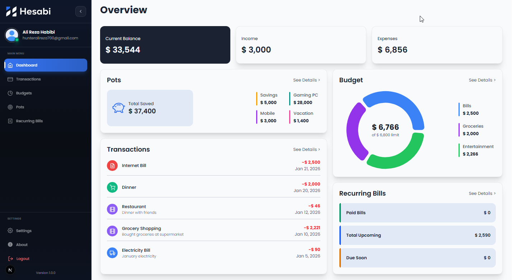

Professional GitHub README
Markdown

<div align="center">
  
  
  # Hesabi
  
  **Know Where Your Money Goes**
  
  A modern personal finance management app to track expenses, manage budgets, and achieve savings goals.
  
  [](LICENSE)
  [](https://nextjs.org/)
  [](https://tailwindcss.com/)
  
  [Live Demo](https://hesabi.vercel.app) • [Documentation](https://hesabi.vercel.app/docs) • [Report Bug](https://github.com/shahreyarhabibi/hesabi/issues)

  
</div>

---

## Features

- 📊 **Dashboard** — Real-time financial overview with interactive charts
- 💳 **Transactions** — Track income and expenses with categories
- 📈 **Budgets** — Set spending limits and monitor progress
- 🐷 **Savings Pots** — Create goals and track savings
- 🔐 **Secure Auth** — Email, Google, and GitHub authentication
- 🌙 **Dark Mode** — Beautiful light and dark themes
- 💱 **Multi-Currency** — Support for USD, EUR, GBP, AFN, and more

---

## Tech Stack

**Frontend:** Next.js 15, React, Tailwind CSS, Recharts, Framer Motion  
**Backend:** Next.js API Routes, NextAuth.js  
**Database:** Turso (Edge SQLite)  
**Email:** MailerSend

---

## Quick Start

````bash
# Clone the repository
git clone https://github.com/shahreyarhabibi/hesabi.git
cd hesabi

# Install dependencies
npm install

# Set up environment variables
cp .env.example .env.local
# Edit .env.local with your credentials

# Run database migrations
npm run migrate:turso

# Start development server
npm run dev
Open http://localhost:3000 in your browser.

Environment Variables
Create a .env.local file with the following:

env

NEXTAUTH_URL=http://localhost:3000
NEXTAUTH_SECRET=your-secret-key
TURSO_DATABASE_URL=your-turso-url
TURSO_AUTH_TOKEN=your-turso-token
GOOGLE_CLIENT_ID=your-google-id
GOOGLE_CLIENT_SECRET=your-google-secret
GITHUB_CLIENT_ID=your-github-id
GITHUB_CLIENT_SECRET=your-github-secret
MAILERSEND_API_KEY=your-mailersend-key
See .env.example for all options.

Author
Ali Reza Habibi — Software Engineer

GitHub
LinkedIn

License
This project is licensed under the MIT License.

<div align="center"> <sub>Built with ❤️ using Next.js and Tailwind CSS</sub> </div> ```
````
